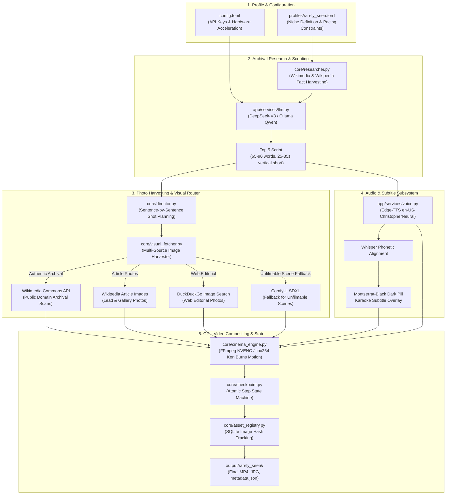

<div align="center">

# 📸 Rare-Studio

### Autonomous AI Short-Form Video Generator for "Top 5 Rare Photos You've Never Seen Before"

**100% CPU Native & Universal Execution • Optional Hardware GPU Acceleration • Archival Research Grounding • LLM Scriptwriting • Photo Harvester (Wikimedia / Wikipedia / Web) • ComfyUI SDXL Fallback • Acoustic Montserrat Dark-Pill Karaoke Subtitles • Durable State Machine**

[](#-system-requirements)
[](https://www.python.org/)
[](LICENSE)
[](#-niche-profile-rarely-seen)
[](#-hardware-compositing)

<p align="center">
  <a href="#-overview">Overview</a> •
  <a href="#-system-architecture">System Architecture</a> •
  <a href="#-niche-profile-rarely-seen">Niche Profile</a> •
  <a href="#-subsystems-deep-dive">Subsystems Deep-Dive</a> •
  <a href="#-quickstart--installation">Quickstart</a> •
  <a href="#-cli-reference">CLI Reference</a> •
  <a href="#-web-gallery-ui">Web Gallery</a>
</p>

</div>

---

## 📽️ Overview

**Rare-Studio** is an autonomous video studio engineered to produce high-retention 9:16 vertical shorts (TikTok, YouTube Shorts, Instagram Reels) focusing on **"Top 5 Rare Photos You've Never Seen Before"**.

The system operates end-to-end without human intervention: topic brainstorming, archival fact synthesis, 25–35s scriptwriting with a strict Top 5 countdown hook, multi-source photo harvesting (Wikimedia Commons, Wikipedia API, DuckDuckGo web photos), speech synthesis with Whisper word alignment, dark-pill karaoke subtitles, Ken Burns motion compositing, and automated deployment to a local web studio gallery.

---

## 🏗️ System Architecture



---

## 🎯 Niche Profile (`rarely_seen`)

Rare-Studio comes pre-configured with the **Rarely Seen** profile ([profiles/rarely_seen.toml](file:///home/kodar/rare-studio/profiles/rarely_seen.toml)):

- **Niche Name**: Rarely Seen (`rarely_seen`)
- **Series Arc**: *Rare Photos You've Never Seen Before*
- **Format**: Top 5 Countdown Shorts (`Number 5:` through `Number 1:`)
- **Target Duration**: 25.0s to 35.0s (65 to 90 words)
- **Voice**: `en-US-ChristopherNeural` at **1.08x rate**
- **Visual Mode**: `photo` via multi-source authentic web harvesting (`bing_web_photos`, Wikimedia, Wikipedia)
- **Subtitles**: Custom `Montserrat-Black.ttf` (Yellow `#FFD700` active word highlights, 70% vertical screen height position)
- **Audio**: Background music with sidechain audio ducking (volume compresses during narration speech)

---

## 🛠️ Subsystems Deep-Dive

### 1. Archival Research Engine ([core/researcher.py](file:///home/kodar/rare-studio/core/researcher.py))
Pulls authentic historical evidence packs, dates, measurements, and proper noun entities from Wikimedia Commons and Wikipedia API to ensure scripts are grounded in real historical facts.

### 2. Multi-Source Photo Harvester ([core/visual_fetcher.py](file:///home/kodar/rare-studio/core/visual_fetcher.py))
Harvests high-resolution authentic photographs while filtering out scanned book pages, PDFs, and generic document graphics using strict MIME and title blacklists.

### 3. Storyboard & Visual Director ([core/director.py](file:///home/kodar/rare-studio/core/director.py))
Deconstructs the narrative script into 5 distinct countdown item scenes. Performs keyword extraction and routes visual requirements to authentic archival photo search or ComfyUI SDXL photorealistic generation.

### 4. Audio & Subtitles ([app/services/voice.py](file:///home/kodar/rare-studio/app/services/voice.py) & [app/services/subtitle.py](file:///home/kodar/rare-studio/app/services/subtitle.py))
Synthesizes narrator speech, extracts word-accurate phonetic alignments with Whisper, and renders Montserrat dark-pill karaoke captions overlaid on 9:16 vertical video.

### 5. Hardware Cinema Engine ([core/cinema_engine.py](file:///home/kodar/rare-studio/core/cinema_engine.py))
Applies smooth dynamic Ken Burns motion presets (zooms, pans) to still photos, synchronizes sentence transitions to speech pauses, compresses background music via FFmpeg sidechain ducking, and encodes using NVIDIA NVENC (`h264_nvenc`) with CPU (`libx264`) fallback.

### 6. Durable State Machine ([core/checkpoint.py](file:///home/kodar/rare-studio/core/checkpoint.py))
Persists pipeline execution state atomically (`pipeline_state_rarely_seen.json`) at each step (`research_completed` → `script_generated` → `audio_generated` → `visuals_fetched` → `rendered`), permitting instant recovery after interruptions.

### 7. Web Video Gallery UI ([runners/gallery.py](file:///home/kodar/rare-studio/runners/gallery.py))
A first-party web studio video player running on port `5050`. Features real-time grid search, metadata inspection, HTTP 206 Partial Streaming, and audio alerts upon new episode completion.

---

## 🚀 Quickstart & Installation

### Requirements
- **Python**: 3.11+
- **FFmpeg**: Installed and available in PATH
- **System**: Linux / Windows WSL2 / macOS

### Setup

```bash
# Clone the repository
git clone https://github.com/kodar/rare-studio.git
cd rare-studio

# Create virtual environment and install dependencies
python3 -m venv .venv
source .venv/bin/python

# Using uv (recommended):
uv sync
```

### Configuration
Copy `config.example.toml` to `config.toml` and configure your LLM API keys (DeepSeek, OpenAI, or Ollama):

```toml
[app]
llm_provider = "deepseek"
deepseek_api_key = "your-deepseek-api-key"
```

---

## 💻 CLI Reference

All commands are executed via [main.py](file:///home/kodar/rare-studio/main.py):

### 1. Run Single Episode
Generates a single video for the Rarely Seen profile:
```bash
python main.py run --profile rarely_seen --topic "The Solway Firth Spaceman Photo Mystery"
```

### 2. Run Series Batch
Generates a batch of sequential or AI-brainstormed episodes:
```bash
python main.py series --profile rarely_seen --count 5
```

### 3. Continuous 24/7 Infinite Generator
Runs an autonomous infinite generator loop across topics:
```bash
python main.py infinite
```

### 4. Web Studio Video Gallery
Launches the Web Studio Gallery on `http://localhost:5050`:
```bash
python main.py gallery --port 5050
```

### 5. Re-burn Karaoke Subtitles
Re-burns Montserrat dark-pill karaoke subtitles onto existing rendered outputs:
```bash
python main.py reburn
```

---

## 📁 Repository Structure

```
rare-studio/
├── main.py                        # Unified CLI Entry Point
├── config.toml                    # API Keys & System Configuration
├── profiles/
│   └── rarely_seen.toml           # "Top 5 Rare Photos" Profile Config
├── core/
│   ├── researcher.py              # Fact & Archival Research Engine
│   ├── visual_fetcher.py          # Multi-Source Photo Harvester
│   ├── director.py                # Storyboard & Shot Planner
│   ├── cinema_engine.py           # FFmpeg NVENC Video Compositor
│   ├── checkpoint.py              # Atomic State Machine
│   ├── asset_registry.py          # SQLite Image Hash Registry
│   └── motion_graphics.py         # Procedural Overlays
├── runners/
│   ├── worker.py                  # Pipeline Orchestrator
│   ├── series.py                  # Series Runner & Topic Generator
│   ├── infinite.py                # 24/7 Continuous Runner
│   ├── gallery.py                 # Web Video Gallery Server (Port 5050)
│   └── reburn.py                  # Karaoke Subtitle Re-burner
├── app/
│   ├── services/
│   │   ├── llm.py                 # LLM Service (DeepSeek/OpenAI/Ollama)
│   │   ├── voice.py               # Voice TTS & Whisper Alignment
│   │   ├── subtitle.py            # Dark-Pill Subtitle Overlay
│   │   └── bgm.py                 # Background Music & Sidechain Ducking
│   └── models/                    # Pydantic Schemas
├── output/                        # Generated MP4 Videos & Metadata
└── storage/                       # Tasks, Checkpoints & Asset SQLite DB
```

---

## 📜 License

Distributed under the [MIT License](LICENSE).
