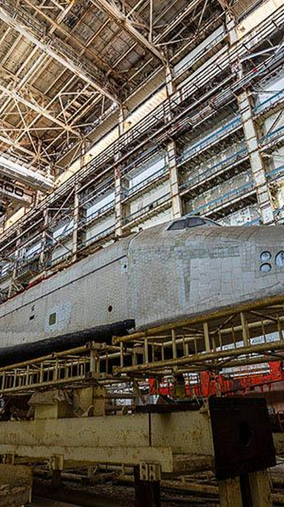
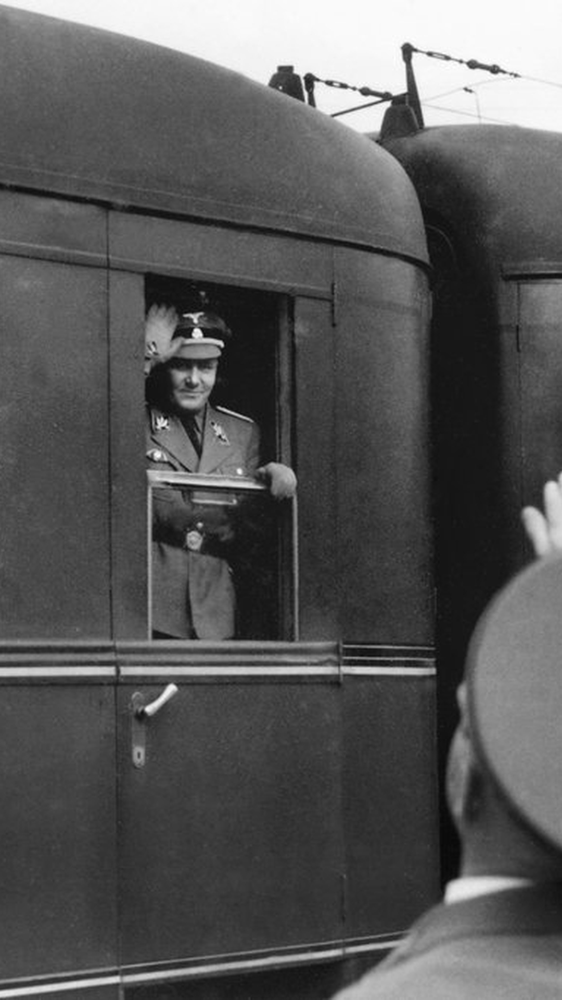
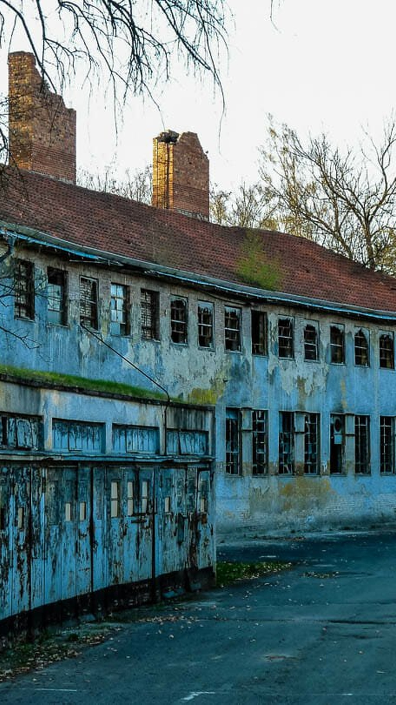
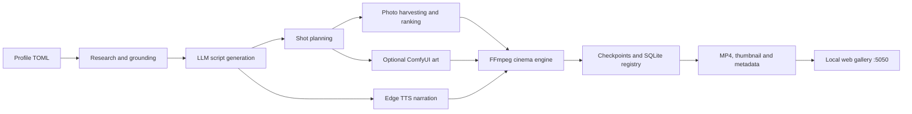
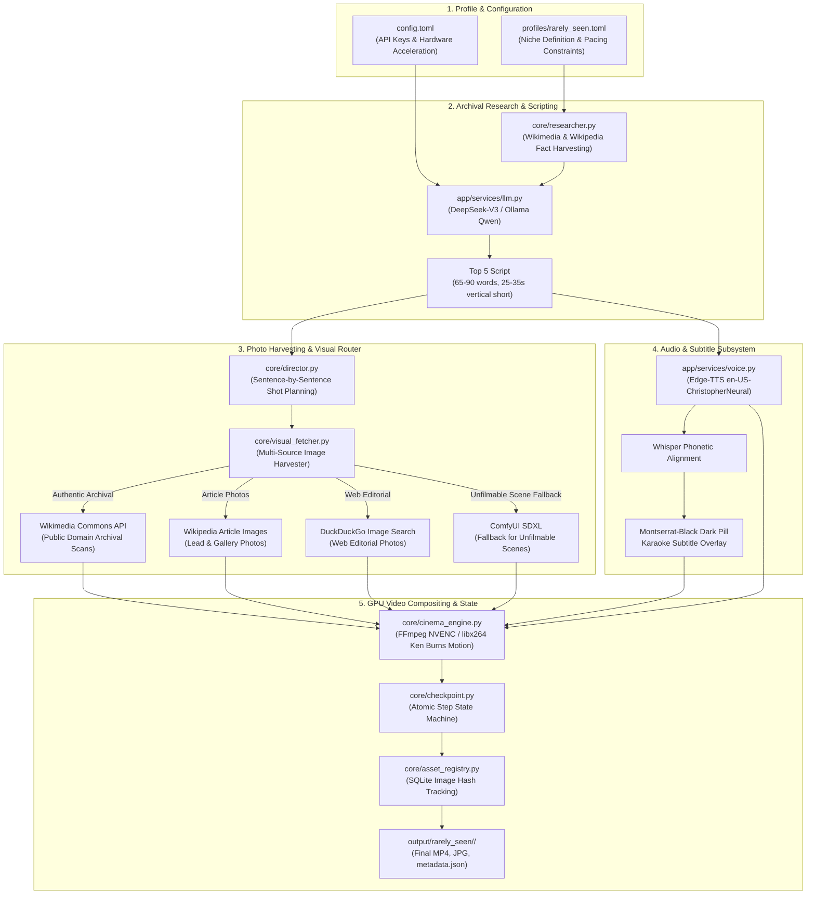

<div align="center">

# Rare-Studio

Rare-Studio is an autonomous, photo-first video production pipeline for short
vertical videos. It researches a topic, writes a narrated countdown script,
plans the visuals, gathers or generates images, synthesizes narration, renders
captions and motion, and publishes finished episodes to a local video gallery.

The bundled `rarely_seen` profile produces mysterious, fast-paced videos in the
format **Rare Photos You've Never Seen Before**. The pipeline is profile-driven,
so the same engine can be adapted to other niches without changing the core
renderer.



> This repository is an active open-source project. The generated previews above
> are real frames from the local output archive. Full render files stay ignored
> by git because a single episode can be several megabytes or more.

[](https://www.python.org/)
[](LICENSE)
[](https://ffmpeg.org/)

## What it does

- researches topics and grounds scripts with archival and web sources;
- generates short countdown scripts through a configurable LLM provider;
- directs each script beat toward photo search or optional ComfyUI art;
- downloads and ranks candidate visuals while tracking reuse in SQLite;
- creates Edge TTS narration and timed subtitle overlays;
- applies Ken Burns-style motion, transitions, music and audio ducking;
- encodes with NVIDIA NVENC when available, with an FFmpeg CPU fallback;
- saves checkpoints so interrupted work can resume;
- serves completed MP4 files in a searchable local gallery.

## Generated output

These are representative episodes already produced by the pipeline:

<table>
    <tr>
        <td></td>
        <td></td>
        <td></td>
    </tr>
    <tr>
        <td align="center">Soviet space shuttle hangars</td>
        <td align="center">WWII photos</td>
        <td align="center">Olympic ghost towns</td>
    </tr>
</table>

Completed episodes are written to:

```text
output/<date>-<profile>/<episode>/
├── <episode>.mp4
├── thumbnail.jpg
├── metadata.json
├── candidates_ranking.json
└── scene_art_*.jpg
```

The checked-in images are documentation previews copied from the local output
archive. Their underlying source media may have separate licensing terms; verify
source and attribution requirements before redistributing generated episodes.

## Architecture



Important modules:

| Area | Entry point | Responsibility |
| --- | --- | --- |
| CLI | [`main.py`](main.py) | Unified command-line entry point |
| Worker | [`runners/worker.py`](runners/worker.py) | End-to-end episode orchestration |
| Research | [`core/researcher.py`](core/researcher.py) | Evidence and source gathering |
| Direction | [`core/director.py`](core/director.py) | Script beats and visual plans |
| Visuals | [`core/visual_fetcher.py`](core/visual_fetcher.py) | Candidate image retrieval and filtering |
| Rendering | [`core/cinema_engine.py`](core/cinema_engine.py) | Motion, compositing and encoding |
| State | [`core/checkpoint.py`](core/checkpoint.py) | Durable pipeline progress |
| Asset registry | [`core/asset_registry.py`](core/asset_registry.py) | SQLite-based asset reuse tracking |
| Gallery | [`runners/gallery.py`](runners/gallery.py) | Local MP4 browser and streamer |

## Requirements

- Python 3.11 or newer
- FFmpeg available on `PATH`
- Network access for the configured LLM, TTS and media sources
- An API key for the selected cloud LLM, or a running local Ollama model

Optional:

- NVIDIA GPU and an FFmpeg build with `h264_nvenc`
- [ComfyUI](https://github.com/comfyanonymous/ComfyUI) for generated fallback art
- Node.js and Chromium for the optional scraper service in `services/scraper`
- Ollama for local LLM execution

## Installation

### Using uv (recommended)

```bash
git clone https://github.com/kodar/rare-studio.git
cd rare-studio
uv sync
cp config.example.toml config.toml
```

`uv sync` uses [`pyproject.toml`](pyproject.toml) and [`uv.lock`](uv.lock),
creates `.venv`, and installs the locked dependencies. Run commands with
`uv run ...` when the environment is not activated.

### Using Python venv and pip

```bash
git clone https://github.com/kodar/rare-studio.git
cd rare-studio
python3 -m venv .venv
source .venv/bin/activate
python -m pip install -r requirements.txt
cp config.example.toml config.toml
```

The project also auto-reexecutes through `.venv/bin/python` when that interpreter
exists, so `python main.py` can be used from the project root after setup.

### Optional scraper service

The Node service is not required for the basic pipeline, but can provide browser
search support when enabled by the configured workflow:

```bash
cd services/scraper
npm ci
npx playwright install chromium
npm start
```

## Configuration

Never commit `config.toml`; it is ignored by git. Start from
[`config.example.toml`](config.example.toml) and provide credentials for the
services you intend to use.

For the bundled profile, configure DeepSeek or change the profile/provider to a
different supported backend:

```toml
[app]
llm_provider = "deepseek"
deepseek_api_key = "your-api-key"
```

The profile in [`profiles/rarely_seen.toml`](profiles/rarely_seen.toml) defines
the current niche, target duration, voice, visual mode, subtitle style and audio
mix. Keep API keys in environment variables or the ignored local config file,
and rotate any key that has ever been committed or shared publicly.

Optional ComfyUI settings:

```bash
export COMFY_PATH="$HOME/comfyui/ComfyUI"
export COMFY_URL="http://127.0.0.1:8188"
```

Optional local LLM:

```bash
ollama serve
ollama pull qwen3:8b
```

## CLI

Run these commands from the repository root. The default profile is
`rarely_seen`.

### Generate one episode

```bash
python main.py run \
    --profile rarely_seen \
    --topic "Inside abandoned Soviet space shuttle hangars" \
    --clear-state
```

Without an explicit topic, the worker can select one using the profile and
configured research/LLM workflow:

```bash
python main.py --clear-state
```

### Generate a batch

```bash
python main.py series --profile rarely_seen --count 5
```

### Run continuously

```bash
python main.py infinite
python main.py infinite --no-gallery
```

### Start the gallery

```bash
python main.py gallery --host 127.0.0.1 --port 5050
```

Open <http://localhost:5050>. The gallery recursively scans `output/`, creates
missing thumbnails with FFmpeg, and supports HTTP range requests for seeking.

### Re-burn subtitles

For the standalone runner, pass output directories positionally:

```bash
python runners/reburn.py output --force
```

## Runtime state and reset

Runtime data is intentionally ignored by git:

```text
storage/tasks/                  task artifacts
storage/checkpoints/            durable checkpoints
storage/asset_registry.db      asset reuse registry
pipeline_state_*.json           pipeline state snapshots
pipeline_debug.log              debug logging
```

To start a new episode while preserving the asset registry:

```bash
python main.py --clear-state
```

To deliberately reset the asset registry as well, remove only the database and
let the next import recreate it:

```bash
rm -f storage/asset_registry.db
python -c "from core.asset_registry import registry; print(registry.get_stats())"
```

## Development

Install development dependencies and run the available checks:

```bash
uv sync --group dev
uv run ruff check .
uv run pytest
```

The codebase is Python-first, with a small Node/Playwright service under
`services/scraper`. Keep generated media, credentials, caches and runtime state
out of commits; the repository `.gitignore` already covers those paths.

## Known limitations

- External APIs, image sources, TTS and optional ComfyUI make a full episode run
    network- and service-dependent.
- Output quality depends on the selected LLM, available source images and the
    accuracy of the research sources.
- The bundled `rarely_seen` profile is tuned for one short-form format rather
    than being a general-purpose video editor.
- Hardware acceleration is opportunistic; FFmpeg falls back to CPU encoding when
    NVENC is unavailable.

## Contributing

Issues and pull requests are welcome. For changes that affect output quality,
include the profile/configuration used, the command run, and a small metadata
sample rather than committing full generated videos.

## License

Released under the [MIT License](LICENSE).

### Autonomous AI Short-Form Video Generator for "Top 5 Rare Photos You've Never Seen Before"

**100% CPU Native & Universal Execution • Optional Hardware GPU Acceleration • Archival Research Grounding • LLM Scriptwriting • Photo Harvester (Wikimedia / Wikipedia / Web) • ComfyUI SDXL Fallback • Acoustic Montserrat Dark-Pill Karaoke Subtitles • Durable State Machine**

[](#-system-requirements)
[](https://www.python.org/)
[](LICENSE)
[](#-niche-profile-rarely-seen)
[](#-hardware-compositing)

<p align="center">
  <a href="#-overview">Overview</a> •
  <a href="#-system-architecture">System Architecture</a> •
  <a href="#-niche-profile-rarely-seen">Niche Profile</a> •
  <a href="#-subsystems-deep-dive">Subsystems Deep-Dive</a> •
  <a href="#-quickstart--installation">Quickstart</a> •
  <a href="#-cli-reference">CLI Reference</a> •
  <a href="#-web-gallery-ui">Web Gallery</a>
</p>

</div>

---

## 📽️ Overview

**Rare-Studio** is an autonomous video studio engineered to produce high-retention 9:16 vertical shorts (TikTok, YouTube Shorts, Instagram Reels) focusing on **"Top 5 Rare Photos You've Never Seen Before"**.

The system operates end-to-end without human intervention: topic brainstorming, archival fact synthesis, 25–35s scriptwriting with a strict Top 5 countdown hook, multi-source photo harvesting (Wikimedia Commons, Wikipedia API, DuckDuckGo web photos), speech synthesis with Whisper word alignment, dark-pill karaoke subtitles, Ken Burns motion compositing, and automated deployment to a local web studio gallery.

---

## 🏗️ System Architecture



---

## 🎯 Niche Profile (`rarely_seen`)

Rare-Studio comes pre-configured with the **Rarely Seen** profile ([profiles/rarely_seen.toml](file:///home/kodar/rare-studio/profiles/rarely_seen.toml)):

- **Niche Name**: Rarely Seen (`rarely_seen`)
- **Series Arc**: *Rare Photos You've Never Seen Before*
- **Format**: Top 5 Countdown Shorts (`Number 5:` through `Number 1:`)
- **Target Duration**: 25.0s to 35.0s (65 to 90 words)
- **Voice**: `en-US-ChristopherNeural` at **1.08x rate**
- **Visual Mode**: `photo` via multi-source authentic web harvesting (`bing_web_photos`, Wikimedia, Wikipedia)
- **Subtitles**: Custom `Montserrat-Black.ttf` (Yellow `#FFD700` active word highlights, 70% vertical screen height position)
- **Audio**: Background music with sidechain audio ducking (volume compresses during narration speech)

---

## 🛠️ Subsystems Deep-Dive

### 1. Archival Research Engine ([core/researcher.py](file:///home/kodar/rare-studio/core/researcher.py))
Pulls authentic historical evidence packs, dates, measurements, and proper noun entities from Wikimedia Commons and Wikipedia API to ensure scripts are grounded in real historical facts.

### 2. Multi-Source Photo Harvester ([core/visual_fetcher.py](file:///home/kodar/rare-studio/core/visual_fetcher.py))
Harvests high-resolution authentic photographs while filtering out scanned book pages, PDFs, and generic document graphics using strict MIME and title blacklists.

### 3. Storyboard & Visual Director ([core/director.py](file:///home/kodar/rare-studio/core/director.py))
Deconstructs the narrative script into 5 distinct countdown item scenes. Performs keyword extraction and routes visual requirements to authentic archival photo search or ComfyUI SDXL photorealistic generation.

### 4. Audio & Subtitles ([app/services/voice.py](file:///home/kodar/rare-studio/app/services/voice.py) & [app/services/subtitle.py](file:///home/kodar/rare-studio/app/services/subtitle.py))
Synthesizes narrator speech, extracts word-accurate phonetic alignments with Whisper, and renders Montserrat dark-pill karaoke captions overlaid on 9:16 vertical video.

### 5. Hardware Cinema Engine ([core/cinema_engine.py](file:///home/kodar/rare-studio/core/cinema_engine.py))
Applies smooth dynamic Ken Burns motion presets (zooms, pans) to still photos, synchronizes sentence transitions to speech pauses, compresses background music via FFmpeg sidechain ducking, and encodes using NVIDIA NVENC (`h264_nvenc`) with CPU (`libx264`) fallback.

### 6. Durable State Machine ([core/checkpoint.py](file:///home/kodar/rare-studio/core/checkpoint.py))
Persists pipeline execution state atomically (`pipeline_state_rarely_seen.json`) at each step (`research_completed` → `script_generated` → `audio_generated` → `visuals_fetched` → `rendered`), permitting instant recovery after interruptions.

### 7. Web Video Gallery UI ([runners/gallery.py](file:///home/kodar/rare-studio/runners/gallery.py))
A first-party web studio video player running on port `5050`. Features real-time grid search, metadata inspection, HTTP 206 Partial Streaming, and audio alerts upon new episode completion.

---

## 🚀 Quickstart & Installation

### Requirements
- **Python**: 3.11+
- **FFmpeg**: Installed and available in PATH
- **System**: Linux / Windows WSL2 / macOS

### Setup

```bash
# Clone the repository
git clone https://github.com/kodar/rare-studio.git
cd rare-studio

# Create virtual environment and install dependencies
python3 -m venv .venv
source .venv/bin/python

# Using uv (recommended):
uv sync
```

### Configuration
Copy `config.example.toml` to `config.toml` and configure your LLM API keys (DeepSeek, OpenAI, or Ollama):

```toml
[app]
llm_provider = "deepseek"
deepseek_api_key = "your-deepseek-api-key"
```

---

## 💻 CLI Reference

All commands are executed via [main.py](file:///home/kodar/rare-studio/main.py):

### 1. Run Single Episode
Generates a single video for the Rarely Seen profile:
```bash
python main.py run --profile rarely_seen --topic "The Solway Firth Spaceman Photo Mystery"
```

### 2. Run Series Batch
Generates a batch of sequential or AI-brainstormed episodes:
```bash
python main.py series --profile rarely_seen --count 5
```

### 3. Continuous 24/7 Infinite Generator
Runs an autonomous infinite generator loop across topics:
```bash
python main.py infinite
```

### 4. Web Studio Video Gallery
Launches the Web Studio Gallery on `http://localhost:5050`:
```bash
python main.py gallery --port 5050
```

### 5. Re-burn Karaoke Subtitles
Re-burns Montserrat dark-pill karaoke subtitles onto existing rendered outputs:
```bash
python main.py reburn
```

---

## 📁 Repository Structure

```
rare-studio/
├── main.py                        # Unified CLI Entry Point
├── config.toml                    # API Keys & System Configuration
├── profiles/
│   └── rarely_seen.toml           # "Top 5 Rare Photos" Profile Config
├── core/
│   ├── researcher.py              # Fact & Archival Research Engine
│   ├── visual_fetcher.py          # Multi-Source Photo Harvester
│   ├── director.py                # Storyboard & Shot Planner
│   ├── cinema_engine.py           # FFmpeg NVENC Video Compositor
│   ├── checkpoint.py              # Atomic State Machine
│   ├── asset_registry.py          # SQLite Image Hash Registry
│   └── motion_graphics.py         # Procedural Overlays
├── runners/
│   ├── worker.py                  # Pipeline Orchestrator
│   ├── series.py                  # Series Runner & Topic Generator
│   ├── infinite.py                # 24/7 Continuous Runner
│   ├── gallery.py                 # Web Video Gallery Server (Port 5050)
│   └── reburn.py                  # Karaoke Subtitle Re-burner
├── app/
│   ├── services/
│   │   ├── llm.py                 # LLM Service (DeepSeek/OpenAI/Ollama)
│   │   ├── voice.py               # Voice TTS & Whisper Alignment
│   │   ├── subtitle.py            # Dark-Pill Subtitle Overlay
│   │   └── bgm.py                 # Background Music & Sidechain Ducking
│   └── models/                    # Pydantic Schemas
├── output/                        # Generated MP4 Videos & Metadata
└── storage/                       # Tasks, Checkpoints & Asset SQLite DB
```

---

## 📜 License

Distributed under the [MIT License](LICENSE).
