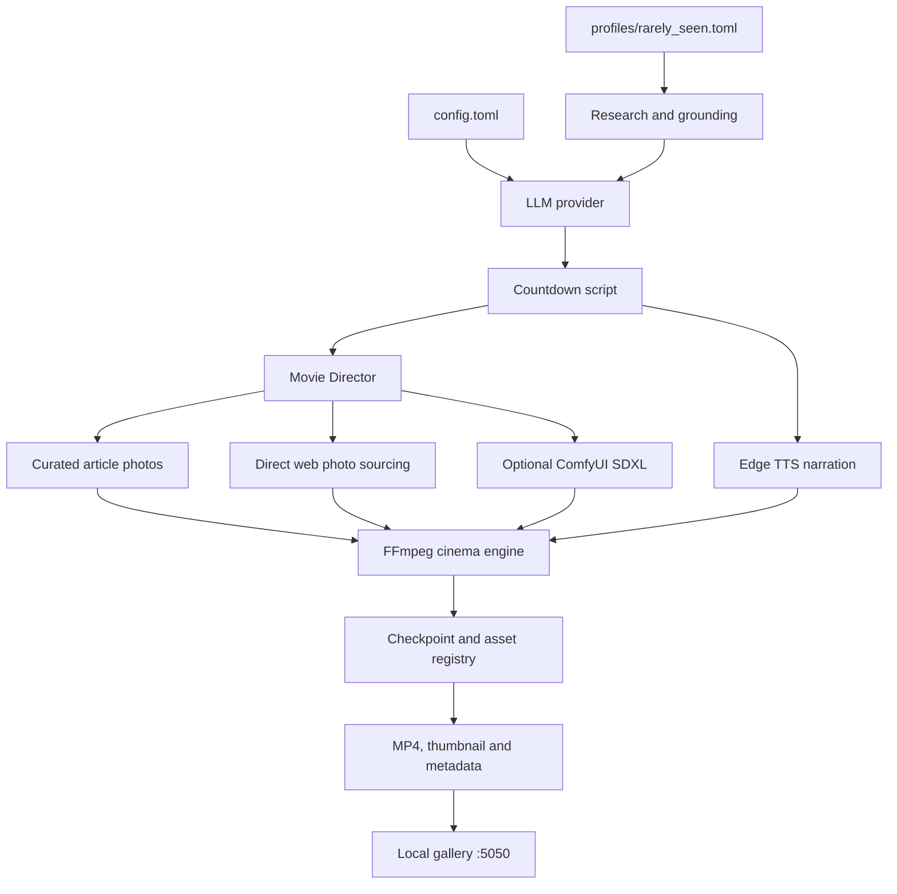

<div align="center">

# Rare-Studio

### Autonomous short-form video production Top 5 for rare photos, hidden places and real historical stories

Research a topic, write a grounded countdown script, source visuals, synthesize
narration, render karaoke subtitles and publish a finished vertical video.

[](https://www.python.org/)
[](LICENSE)
[](https://ffmpeg.org/)

</div>

## What Rare-Studio does

Rare-Studio is a profile-driven AI video pipeline. The bundled `rarely_seen`
profile is tuned for mysterious, fast-paced **Rare Photos You've Never Seen
Before** episodes, but the worker, director, renderer and gallery are designed
to be reused for other niches.

A typical production moves through six stages:

1. **Research and grounding**: gathers topic context and, for photo-first
   profiles, builds a candidate pool of authentic images and backstories.
2. **Narration**: generates a short script through the configured LLM and
   synthesizes Edge TTS voiceover.
3. **Karaoke subtitles**: creates word-timed subtitle data for the narration.
4. **Shot direction and sourcing**: turns script beats into scenes, then uses
   selected photos, direct web images, optional ComfyUI art or a procedural
   fallback.
5. **Cinema rendering**: applies motion, transitions, watermarking, music
   ducking and FFmpeg encoding.
6. **Archive packaging**: writes the MP4, thumbnail, metadata and ranking report
   into the profile archive and exposes it in the local gallery.

## Proof from the pipeline

These are preview frames from real episodes already generated in the local
output archive. They show different subjects going through the same production
system rather than a single demo hard-coded for one topic.

<table>
  <tr>
    <td></td>
    <td></td>
    <td></td>
  </tr>
  <tr>
    <td align="center"><b>Inside Abandoned Soviet Space Shuttle Hangars</b><br>39 seconds</td>
    <td align="center"><b>WWII Photos They Tried to Erase</b><br>40 seconds</td>
    <td align="center"><b>Olympic Ghost Towns</b><br>41 seconds</td>
  </tr>
</table>

Other generated episodes in the archive include **Chernobyl's Forbidden Photos
Revealed**, **Deep Sea Photos That Leave You Speechless**, **5 Islands So Remote
They're Terrifying**, and a five-part `Rare Photos You've Never Seen Before`
series. The profile targets 25-35 seconds and 65-90 words, but final duration
varies with narration and scene timing.

The preview images are intentionally small documentation assets. Full videos
remain excluded from git because they are large runtime artifacts. Source images
used in generated episodes may have separate licenses and attribution
requirements; verify them before publishing or redistributing an episode.

## Architecture



### Core modules

| Area | Module | Responsibility |
| --- | --- | --- |
| CLI | [`main.py`](main.py) | Unified commands for workers, series, gallery and subtitle reburns |
| Orchestration | [`runners/worker.py`](runners/worker.py) | Runs the six-stage production pipeline |
| Research | [`core/researcher.py`](core/researcher.py) | Topic research and evidence context |
| Archival sourcing | [`app/services/archival_crawler.py`](app/services/archival_crawler.py) | Curated article discovery and verified image downloads |
| Visual direction | [`core/director.py`](core/director.py) | Converts scripts into scene and shot plans |
| Web visuals | [`core/cinema_engine.py`](core/cinema_engine.py) | Direct image search, deduplication and motion-clip creation |
| Rendering | [`core/cinema_engine.py`](core/cinema_engine.py) | Ken Burns motion, transitions, audio mix and FFmpeg encoding |
| Voice | [`app/services/voice.py`](app/services/voice.py) | Edge TTS narration and alignment inputs |
| Subtitles | [`app/services/subtitle.py`](app/services/subtitle.py) | Word-timed karaoke subtitle rendering |
| State | [`core/checkpoint.py`](core/checkpoint.py) | Atomic progress persistence and resume support |
| Asset registry | [`core/asset_registry.py`](core/asset_registry.py) | SQLite URL, title and content reuse tracking |
| Gallery | [`runners/gallery.py`](runners/gallery.py) | Local searchable MP4 player with range streaming |

## Visual sourcing paths

Node.js is **not required by the renderer or gallery**. It is an optional
browser-backed source used by the default `rarely_seen` archival stage.

### Curated archival articles

The worker can start the Playwright service in `services/scraper` on port `4050`.
That service discovers curated article pages and returns image candidates and
backstories to [`archival_crawler.py`](app/services/archival_crawler.py).
Downloaded images are checked for dimensions, file validity, duplicates and
blocked stock or document patterns before ranking.

Install it when you want the strongest photo-first workflow:

```bash
cd services/scraper
npm ci
npx playwright install chromium
npm start
```

If Node.js is unavailable, the worker continues to the other sourcing paths,
but the curated article-photo candidate pool may be empty.

### Direct web images

The cinema engine can also search and download direct web images for individual
scenes. Candidate URLs and image bytes are checked against the persistent asset
registry and current episode keys to avoid reuse.

### ComfyUI fallback

ComfyUI can generate photorealistic scene art when authentic imagery cannot be
found. It is optional and can be configured with:

```bash
export COMFY_PATH="$HOME/comfyui/ComfyUI"
export COMFY_URL="http://127.0.0.1:8188"
```

If no web image or ComfyUI result is available, the renderer has a procedural
last-resort canvas so the pipeline can still complete a renderable scene.

## The bundled profile

[`profiles/rarely_seen.toml`](profiles/rarely_seen.toml) defines the current
creative direction:

- **Niche**: Rarely Seen
- **Series arc**: *Rare Photos You've Never Seen Before*
- **Format**: fast Top 5 countdown narration
- **Target**: 25-35 seconds and 65-90 words
- **LLM**: DeepSeek `deepseek-chat`
- **Voice**: Edge TTS `en-US-ChristopherNeural` at 1.08x
- **Visual mode**: 9:16 photo-first scenes with 3-second target clips
- **Subtitles**: Montserrat Black, rounded dark background, gold active words
- **Audio**: random background music with narration ducking
- **Watermark**: `rare-studio` in the bottom-right corner

The visual source name in the profile is a legacy label; the current worker uses
curated article discovery, direct web-photo sourcing and optional ComfyUI paths.

## Installation

### Requirements

- Python 3.11 or newer
- FFmpeg on `PATH`
- Network access to the configured LLM, TTS and image sources
- An API key for the selected cloud LLM, or a running local Ollama model

Optional components:

- Node.js, npm and Playwright for curated article discovery
- NVIDIA GPU with FFmpeg `h264_nvenc`
- ComfyUI for generated fallback visuals
- Ollama for local LLM execution

### Using uv

```bash
git clone https://github.com/kodar/rare-studio.git
cd rare-studio
uv sync
cp config.example.toml config.toml
```

`uv sync` uses [`pyproject.toml`](pyproject.toml) and [`uv.lock`](uv.lock),
creates `.venv`, and installs the locked dependencies. Run commands as
`uv run python main.py ...` when the environment is not activated.

### Using Python and pip

```bash
git clone https://github.com/kodar/rare-studio.git
cd rare-studio
python3 -m venv .venv
source .venv/bin/activate
python -m pip install -r requirements.txt
cp config.example.toml config.toml
```

From the project root, `python main.py` also re-executes through
`.venv/bin/python` when that interpreter exists.

The repository includes [`install.sh`](install.sh), which checks FFmpeg and
Python, creates or reuses `.venv`, installs Python requirements and can install
the `rare-studio` command. Review it before allowing it to install system
packages or optional services on your machine.

## Configuration

`config.toml` is ignored by git. Copy [`config.example.toml`](config.example.toml)
and keep all real credentials in the local copy or environment variables.

For the bundled profile, the practical minimum is a DeepSeek key:

```toml
[app]
llm_provider = "deepseek"
deepseek_api_key = "your-api-key"
```

The example app configuration currently defaults to Moonshot, while the
`rarely_seen` profile selects DeepSeek in its own `[llm]` section. The profile
selection therefore wins for the default worker run. Change the profile or
provider deliberately if you use another supported backend.

For local generation with Ollama:

```bash
ollama serve
ollama pull qwen3:8b
```

Never commit `config.toml`, API keys, cookies or downloaded credentials. Rotate
any credential that has been exposed in a public repository or terminal log.

## CLI reference

Run commands from the repository root. The default profile is `rarely_seen`.

### One episode

Use an explicit topic when you want deterministic subject selection:

```bash
python main.py run \
  --profile rarely_seen \
  --topic "Inside abandoned Soviet space shuttle hangars"
```

Use the root command to let the configured workflow choose a topic:

```bash
python main.py --clear-state
```

`--clear-state` clears the saved checkpoint for a fresh session. It does not
delete the output archive or asset registry.

### Batch series

```bash
python main.py series --profile rarely_seen --count 5
```

### Continuous generation

```bash
python main.py infinite
python main.py infinite --no-gallery
```

### Gallery

```bash
python main.py gallery --host 127.0.0.1 --port 5050
```

Open <http://localhost:5050>. The gallery recursively scans `output/`, derives
metadata from each episode, generates missing thumbnails with FFmpeg and serves
video ranges for smooth seeking.

### Subtitle reburn

Use the standalone runner with a positional target directory:

```bash
python runners/reburn.py output --force
```

It uses Whisper word timestamps when available and falls back to existing SRT
timing when Whisper cannot be loaded.

## Output and state

Completed episodes are archived by profile:

```text
output/
└── rarely_seen/
    └── <episode-slug>/
        ├── <episode-slug>.mp4
        ├── thumbnail.jpg
        ├── metadata.json
        ├── candidates_ranking.json
        └── scene_art_*.jpg
```

Runtime state stays outside the archive:

```text
storage/tasks/                   task-local audio, candidates and clips
storage/checkpoints/             checkpoint storage
storage/asset_registry.db        persistent asset reuse registry
pipeline_state_rarely_seen.json  current worker state
pipeline_debug.log               debug log
```

To start a new pipeline session while keeping prior asset history:

```bash
python main.py --clear-state
```

To reset the asset registry separately:

```bash
rm -f storage/asset_registry.db
python -c "from core.asset_registry import registry; print(registry.get_stats())"
```

## Development

Install development dependencies and run the available checks:

```bash
uv sync --group dev
uv run ruff check .
uv run pytest
```

The project is Python-first, with a small Node/Playwright service under
`services/scraper`. Generated media, local credentials, caches and runtime
state are intentionally ignored by git.

## Known limitations

- Full production depends on external LLM, TTS, image and research services.
- The bundled profile is optimized for one short-form format, not general video
  editing.
- Source availability and licensing vary by topic; review image attribution
  before publishing.
- NVENC is opportunistic and falls back to CPU encoding.
- The curated archival source is strongest with the Node/Playwright service;
  without it, direct web images and ComfyUI remain fallback paths.

## Contributing

Issues and pull requests are welcome. For changes affecting output quality,
include the profile, command and relevant metadata rather than committing full
videos or credentials.

## License

Released under the [MIT License](LICENSE).
